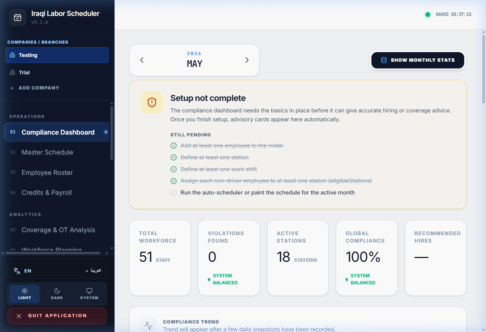
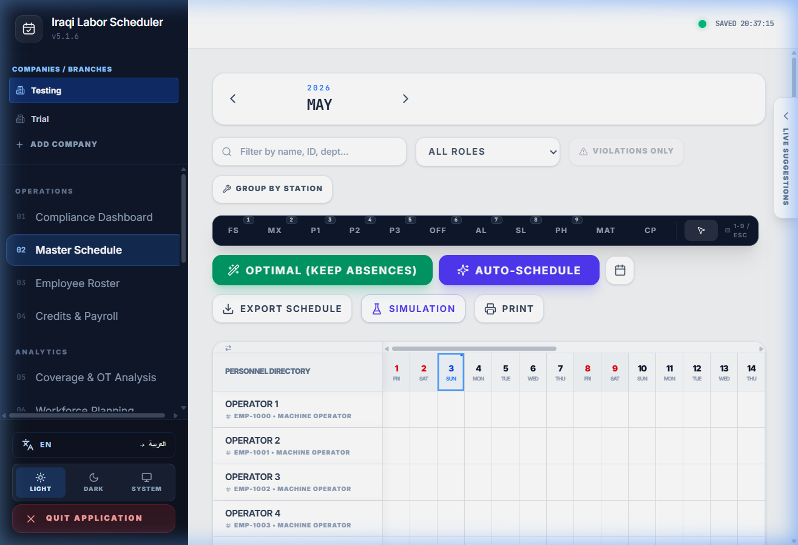
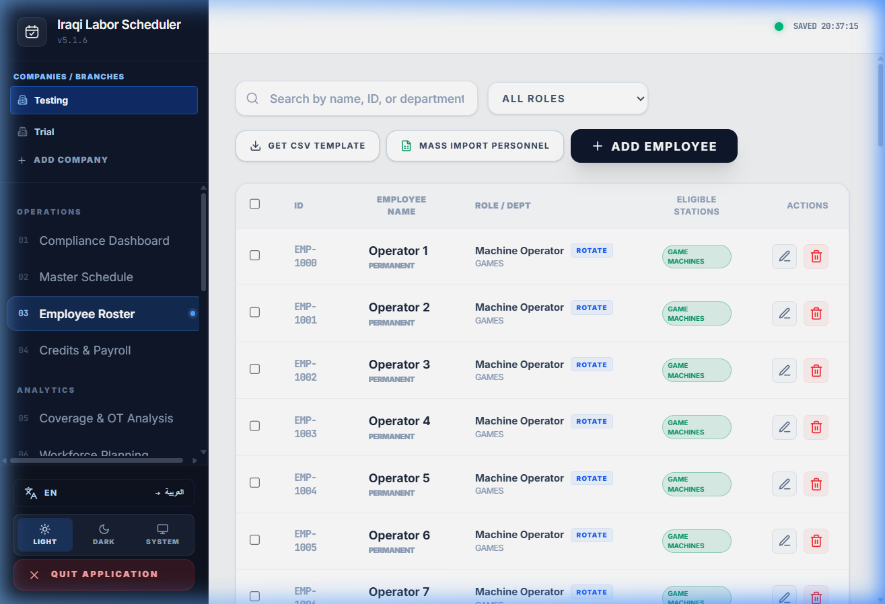
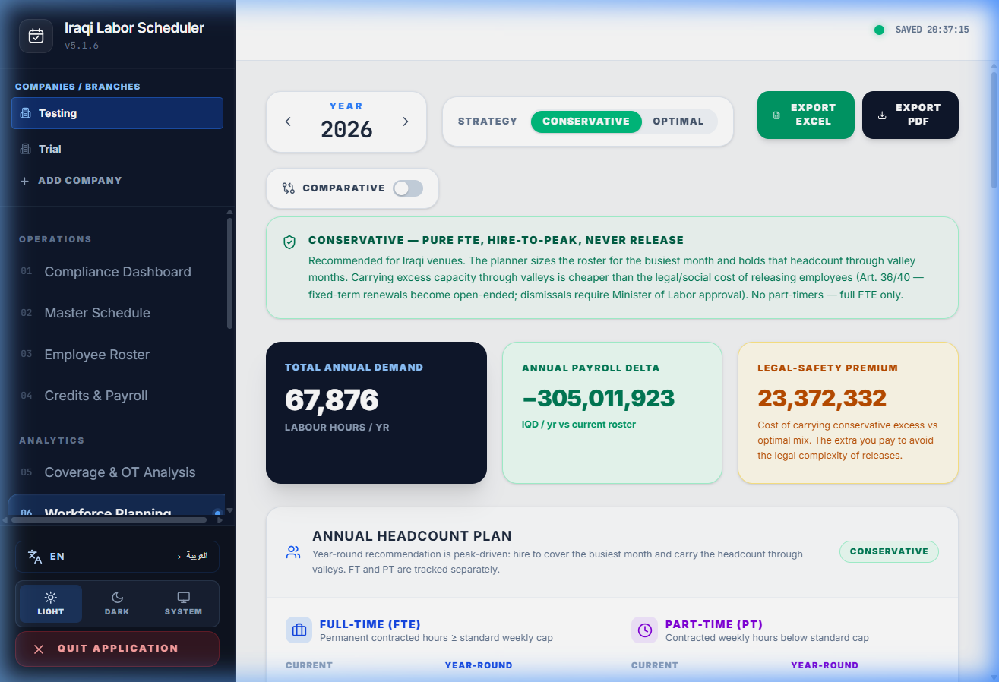
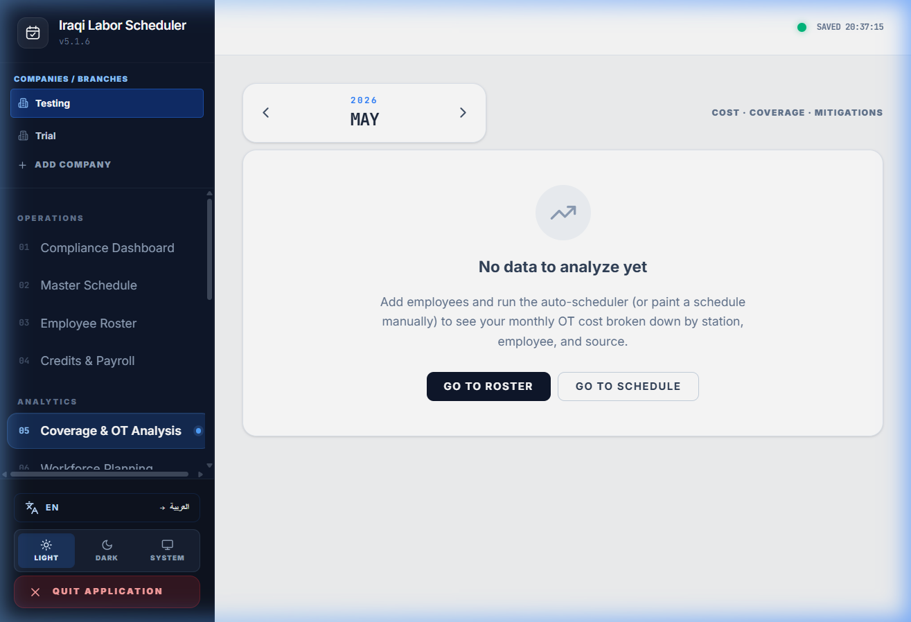

# Iraqi Labor Scheduler

A workforce scheduler tailored for **Iraqi Labor Law**. Plan shifts across multiple companies, get a per-shift compliance check against Articles 67–88, and run an auto-scheduler that respects every cap automatically.

Runs as a native Windows app. Two modes: **fully offline** for a single supervisor, or **multi-user online** via your own free Firebase project.


## App Overview

| Dashboard | Master Schedule |
|:---:|:---:|
|  |  |
| **Employee Roster** | **Workforce Planning** |
|  |  |
| **Coverage & OT Analysis** | |
|  | |


---

## What it does (quickly)

- **Knows Iraqi Labor Law.** Daily/weekly hour caps (Art. 67/70), hazardous-work caps (Art. 68), mandatory rest (Art. 71/72), public-holiday compensation (Art. 73/74), driver caps (Art. 88), sick & maternity leave (Art. 84/87), the women-night-work rule (Art. 86), and Ramadan reduced hours. Every threshold is editable in the **Variables** tab so you can tune to a Ministerial decree or a CBA.
- **Auto-schedules.** Click one button and the app fills your stations using each employee's eligibility, role, preferences, leaves, and the legal limits. 50+ employees in milliseconds. There's an *Optimal (Keep Absences)* mode that fills only empty cells around your manual edits, so you can hybrid manual + auto in one click.
- **Reports, doesn't enforce.** The compliance engine surfaces violations and informational findings; you decide. PDF reports, CSV payroll drafts, an audit log, and a 30-day compliance trendline come out of the box.
- **Multi-company.** One install can manage several branches. Each company has its own employees, shifts, stations, holidays, and configuration.
- **Bilingual.** English + Arabic with full RTL.

> **The compliance philosophy**: this platform reports, it doesn't enforce. The user is always free to override — findings exist to inform the supervisor, not to block work.

---

## Two modes — pick one at first launch

| | **Offline Demo** | **Connect Online** |
|---|---|---|
| **Best for** | One supervisor on one machine | A team across multiple branches |
| **Network needed?** | Never | Sign-in only; edits queue offline and sync on reconnect |
| **Setup** | Zero | One-time Firebase project (free Spark plan, ~10 min) |
| **Where data lives** | Local JSON in `%APPDATA%\Roaming\iraqi-labor-scheduler\data\` | Your own Firebase Firestore project |
| **Roles** | N/A (single user) | Super-admin / Admin / Supervisor with per-tab permissions |
| **Cost** | Free | Free (no Cloud Functions, no Blaze, no credit card) |

You can switch modes any time from **Settings → Switch mode**. The choice persists.

For Online mode, the in-app wizard walks the super-admin through Firebase project creation step by step. The only steps that touch the Firebase Console are creating the project and enabling Firestore + Auth (Firebase reserves those for the Console). Everything after that — the `firebaseConfig` paste, the service-account JSON link, even creating the super-admin's own login — happens in-app. Returning super-admins on a new PC follow a shorter "reconnect" wizard that includes the service-account link step, so User Management works on first sign-in. Team members join with a one-string `ils-connect:…` connection code the super-admin shares with them.

Full Firebase walkthrough: [`FIREBASE_SETUP.md`](FIREBASE_SETUP.md).

---

## Install (5 minutes)

1. Go to [**Releases**](https://github.com/assassinoa93/iraqi-labor-scheduler/releases).
2. Under the latest release, download both `Iraqi-Labor-Scheduler-Setup-X.Y.Z.exe` and `SHA256SUMS.txt`.
3. Verify the installer's hash (recommended). In PowerShell, in the folder where you saved both files:
   ```powershell
   Get-FileHash -Algorithm SHA256 .\Iraqi-Labor-Scheduler-Setup-X.Y.Z.exe
   ```
   The printed hash must match the line in `SHA256SUMS.txt`. If it doesn't, **don't run the installer** — re-download or open an issue.
4. Double-click the `.exe`. Open the app from the desktop shortcut.

### Updating from an earlier version

Just run the new installer. **Don't uninstall first.** The wizard detects the existing installation and runs an in-place update. On first launch the app snapshots your data folder to `data-backup-<old-version>-<timestamp>/`, keeping the 5 most recent. If anything looks wrong after an update: close the app, rename the snapshot back to `data`, relaunch.

### About the Windows SmartScreen warning

Windows SmartScreen / Chrome will warn that this app is unsigned. That's expected — the warning is the *absence* of a Microsoft-trusted Authenticode signature, not anything malicious. The hash check above is the right way to confirm the installer is byte-identical to what GitHub Actions built from this open-source code. We're applying for free open-source code signing through [SignPath Foundation](https://signpath.org/about); once approved, the warning goes away.

To bypass the warning safely after verifying the hash: in Chrome's download bar, click the down-arrow → **Keep**. In the SmartScreen dialog: **More info** → **Run anyway**.

---

## For developers

### Prerequisites
- [Node.js](https://nodejs.org/) v20+

### Common commands
```bash
npm install                # install dependencies
npm run electron:dev       # dev mode (native window + hot reload)
npm test                   # vitest unit tests (108 tests, ~3s)
npm run lint               # tsc --noEmit
npm run electron:build     # produce a signed-by-hash Windows installer
```

The repo contains **zero credentials**. To run Online mode locally you'll need to create your own Firebase project — see [`FIREBASE_SETUP.md`](FIREBASE_SETUP.md). `.env.local` is gitignored.

### One-click build (Windows)

Double-click `CREATE_MY_DESKTOP_APP.vbs`. It runs `npm install`, builds the assets, and produces an installer.

### Project layout

<details>
<summary>Click to expand</summary>

```
src/
├── App.tsx                       # Top-level shell + state, multi-company + sim-mode wiring
├── tabs/                         # One file per sidebar tab (code-split via React.lazy)
├── components/                   # Cross-cutting modals + primitives
│   ├── Onboarding/               # First-time + reconnect super-admin wizards
│   └── SuperAdmin/               # Connection / Quota / Companies / Database panels
└── lib/
    ├── compliance.ts             # ComplianceEngine + previewAssignmentWarnings
    ├── autoScheduler.ts          # Greedy fill with soft preferences + PH-debt bias
    ├── coverageHints.ts          # Detect gaps + rank swap candidates
    ├── staffingAdvisory.ts       # Pure compute for the 3-mode dashboard advisory
    ├── firestoreClient.ts        # Firestore w/ persistentLocalCache (online cache)
    ├── firestoreSync.ts          # Connection-status hook (online/syncing/queued)
    ├── firestoreErrors.ts        # Friendly quota-exhausted detection
    ├── adminApi.ts               # Renderer wrapper around the admin-bridge IPC
    └── …                         # i18n, payroll, leaves, migration, …

electron/
├── main.cjs                      # Window + tray + post-update data snapshot
├── preload.cjs                   # adminApi bridge surface
└── admin-bridge.cjs              # Firebase Admin SDK in main process — users, audit purge, quota

server.ts                         # Express + atomic JSON writes (Offline mode only)
```

</details>

### Architecture notes

- **Offline mode** uses a small Express server (`server.ts`) that owns the JSON files in `%APPDATA%`. The renderer talks to it over `127.0.0.1`, locked to that interface — no network exposure.
- **Online mode** uses Firestore as the single source of truth. The Firestore Web SDK's `persistentLocalCache` handles outage resilience (writes queue locally, sync on reconnect) so there's no parallel local copy to fall out of sync.
- **Admin SDK** (Firebase) loads in the Electron main process via `electron/admin-bridge.cjs` and is reachable from the renderer through a narrow IPC surface. Service-account JSONs are stored per-project under `<userData>/firebase-admin/<projectId>/serviceAccount.json` and never bundled with the installer.
- **108 unit tests** cover the compliance engine, auto-scheduler, coverage-hint detection, staffing advisory, OT analysis, payroll, and workforce planning. Run with `npm test`.

---

## Releases & changelog

- Every tagged release on GitHub is built by GitHub Actions and ships an installer + `SHA256SUMS.txt`.
- For version-by-version changes (current and historical), see [`CHANGELOG.md`](CHANGELOG.md).
- Latest release notes: see the **Releases** page.

## Legal framework

The app supports **Iraqi Labor Law No. 37 of 2015**:

- **Art. 67 / 70** — standard 8-hour day / 48-hour week
- **Art. 68** — 7-hour daily cap for hazardous work
- **Art. 71** — 24-hour weekly rest, 11-hour minimum between shifts
- **Art. 72** — maximum consecutive working days
- **Art. 73 / 74** — public-holiday work: double pay or compensation day
- **Art. 84** — paid sick leave
- **Art. 86** — restrictions on women's night work in industrial undertakings (off by default; enable in Variables)
- **Art. 87** — 14-week paid maternity leave
- **Art. 88** — driver / transport caps (9h daily, 56h weekly, 4.5h continuous, 11h rest)

All thresholds are editable in the **Variables** tab.

## License

Apache-2.0. See [`LICENSE`](LICENSE).

## Acknowledgements

Built with React, Electron, Firebase, react-window, jspdf, motion, date-fns, sharp, and Tailwind CSS. Tailored for the Iraqi workforce.
