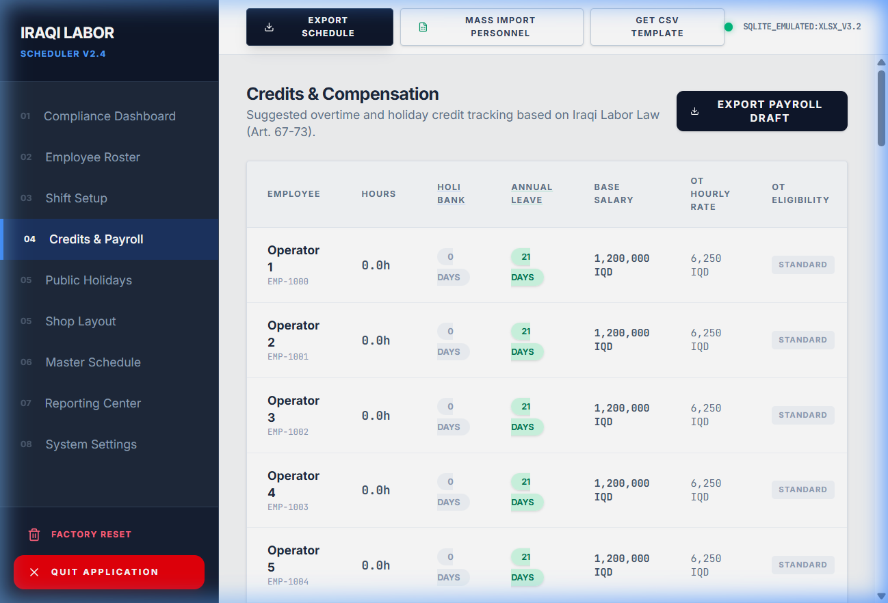
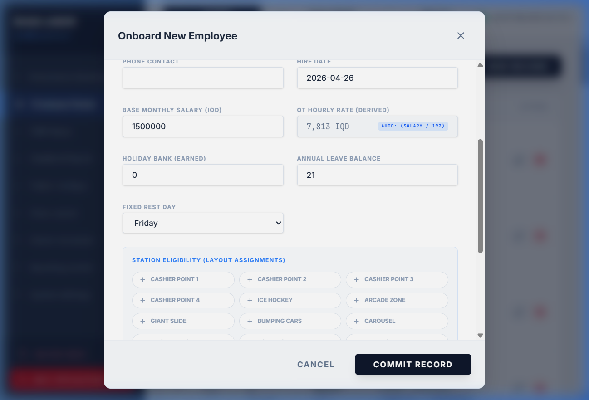
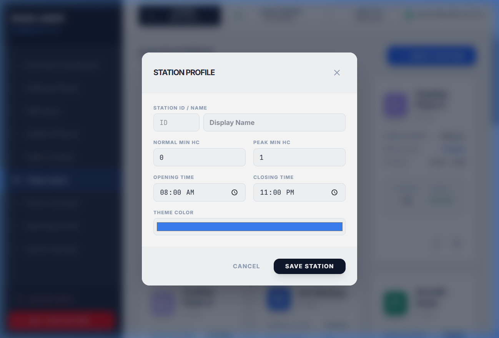

# 🇮🇶 Iraqi Labor Scheduler (Standalone)

A professional, local-first workforce management and automated scheduling system tailored for **Iraqi Labor Law (Art. 67-74, Art. 84, Art. 86, Art. 87, Art. 88)**.


## 🌟 Key Features

### Compliance & legal
- **⚖️ Compliance engine**: Automated checks for daily/weekly hour caps (Art. 67/70), hazardous-work caps (Art. 68), mandatory rest (Art. 71-72), holiday compensation (Art. 73-74), **transport-worker rules for drivers (Art. 88)**, **sick leave (Art. 84)**, **maternity leave (Art. 87)**, and the **Art. 86 women's night-work rule** for industrial undertakings. Findings are split into two severity tiers — `'violation'` for hard rule breaches that drag the compliance score down, and `'info'` for legitimate operational situations the supervisor needs to be aware of (e.g. holiday worked → eligible for double pay; comp day owed within 7 days). The platform aids compliance through reporting, never enforces by blocking.
- **📜 Legal Variables tab**: Every cap (daily / weekly / hazardous / driver / OT multipliers / Ramadan reduced-hours / Art. 86 night window) is editable in one place with the governing article tagged on each value. Edits flow live into the engine and the auto-scheduler.
- **🌙 Ramadan mode**: Set a date range and a reduced daily-hour cap (default 6h). The auto-scheduler refuses to assign longer shifts to non-driver, non-hazardous staff during the window; the engine flags any breach as an `(Ramadan)` violation.
- **🤰 Maternity leave (Art. 87)**: Mark protected 14-week leave on any female employee. The auto-scheduler stamps `MAT` on those days and skips the employee for assignments. Manual work shifts during the window surface as a violation.
- **🤒 Sick leave (Art. 84)**: Same date-range model as maternity. The auto-scheduler stamps `SL`, the engine flags any work shift assigned during the window.
- **🏖️ Annual leave**: Approved-vacation date range per employee. Auto-scheduler stamps `AL`, compliance flags work shifts inside the window.
- **🚚 Driver / Transport mode**: Mark personnel as Drivers and have them scheduled under stricter caps — 9h daily / 56h weekly, 4.5h continuous-driving cap, 11h min daily rest. Configurable per fleet.
- **🌃 Art. 86 night-work rule**: Optional. When enabled (Variables tab), any shift flagged industrial that overlaps the configured night window (default 22:00–07:00) and is assigned to a female employee surfaces as an Art. 86 violation; the auto-scheduler treats it as a hard rule at the legal/continuity strictness levels.
- **🔁 Cross-month rolling-7 awareness**: Compliance engine and auto-scheduler peek at the trailing 6 days of the prior month so weekly caps don't reset arbitrarily on day 1.

### Scheduling power
- **🤖 Auto-Scheduler**: Fills your shop layout stations automatically based on employee eligibility, role, category, and legal limits. Indexed for performance — 50+ employee rosters complete in milliseconds.
- **🪄 Optimal (Keep Absences) mode**: A second scheduler button next to Auto-Schedule. Input the month's leaves, vacations, and any manual shift overrides first, then click *Optimal (Keep Absences)* — the algorithm fills only the empty cells around your locked entries, with the locked rows still counted toward station headcount and the rolling-7-day cap. Lets you build a "manual edits + auto-fill" hybrid in one click without losing what you've already entered.
- **🧪 Simulation / forecasting mode**: Toolbar toggle freezes a baseline, suspends auto-save, and renders a delta panel comparing baseline vs. sandboxed state across workforce size, coverage %, OT hours, OT pay (IQD), and violations. Apply / Reset / Discard. Lets you model "what if I hire 3 more cashiers?" or "what if I open Friday from 09:00?" without touching saved data.
- **🪄 Coverage-gap hint toast**: When a manual edit vacates a station-bound work shift (or a leave date range empties cells), a non-blocking bottom-right toast surfaces the affected day + station and lists swap candidates ranked by score (off-day employees first, preference match, compliance warnings factored in). The most optimal pick is flagged with a ⭐ "Recommended" badge; the candidate list refreshes live as you keep editing, and auto-dismisses if the gap fills itself. One-click swap or "Keep gap" override — the original change is never rolled back. After a swap, both the source and destination cells flash with a pulsing amber ring for 5 seconds so you can see exactly what moved.
- **👁️ Schedule Preview & Undo**: Review the auto-scheduler's proposed assignments, hours, and compliance impact before applying. A 5-deep undo stack lets you revert recent applies.
- **🔄 Rotating Rest Day**: Toggle "No Fixed Rest Day" on any employee — the auto-scheduler rotates their off across the week so weekend coverage is shared fairly between staff.
- **🎯 Shift preferences**: Mark preferred / avoided shift codes per employee. The auto-scheduler honours preferences as a *soft* constraint at the legal-strictness level — biases the candidate sort toward preferred codes and skips avoided ones — and ignores them at relaxed levels so coverage is never sacrificed.
- **🎨 Paint mode + live conflict warnings**: Click a shift code to enter paint mode, then click cells to assign. Each paint runs a focused dry-run check — if the assignment would breach a daily / weekly / rest / consec-day / leave / Ramadan / Art. 86 / holiday rule, an inline amber banner names the conflict.
- **🔍 Roster + schedule grid filters**: Search by name / ID / department, filter by role, sort columns. The schedule grid is fully virtualized — large rosters (50+) stay snappy.

### Productivity
- **🪟 Live Suggestion Pane (Schedule tab)**: Persistent right rail that replaces the bottom-right toast. Two sections: **coverage suggestions** (live candidate list when a manual edit creates a gap, with one-click swap and a ⭐ recommended pick) and **recent changes** (per-session log of every cell edit — paint, cycle, swap, leave-stamp — each with its own undo button). Collapsible to a thin tab against the right edge. Cross-tab edits (e.g. adding a leave from Credits & Payroll) still surface a fallback toast on non-Schedule tabs.
- **📊 3-Mode Staffing Advisory (Dashboard)**: Tab strip on the dashboard advisory card flips between hiring strategies — *Eliminate Overtime* (absorb every OT hour into FTE shifts), *Optimal Coverage* (close every peak-hour gap), *Best of Both* (the conservative ceiling). Each shows hires needed, OT saved (IQD/mo), salary added (IQD/mo), and net monthly delta so the supervisor can weigh tradeoffs before committing.
- **📅 Multi-range leave manager**: Open Credits & Payroll, click *Manage* on any employee, and add as many leave windows as you need (annual / sick / maternity) each with its own start/end and notes. Adding a leave automatically stamps the matching `AL` / `SL` / `MAT` codes on the schedule grid AND surfaces a coverage-hint with swap candidates for the most-impactful affected day — single source of truth, no double-input.
- **🎁 Public-holiday comp days**: The auto-scheduler tracks per-employee comp-day debt (incremented on each PH-work assignment, decremented on the next OFF/leave) and biases the candidate sort to push debtors toward OFF in the days following — naturally satisfying Art. 74's compensation-day expectation. A `Comp day owed` info-finding fires when no rest appears within 7 days.
- **🖱️ Schedule grid power-ups**: Drag-to-paint, Shift+click range fill, per-cell undo (Ctrl+Z) separate from the Auto-Schedule undo, today indicator (blue ring) on the active day, holiday dot in the header with full holiday name in the tooltip, and a footer summary bar (total work hours, employees at-cap / near-cap, employees with any leave-day this month).
- **📋 Bulk shift assignment**: Select N employees in the Roster, hit *Assign Shift*, pick a shift code and day range, choose whether to overwrite existing entries — paints the rectangle in one shot.
- **👤 Per-employee labor-law card**: Hover any employee name in the schedule grid to see a tooltip with hours-vs-cap, peak weekly window, longest streak, and last day worked. A small badge appears on rows that are at or above 90% of their weekly cap so you spot saturated employees before painting another shift.
- **📈 Compliance trendline**: A sparkline on the Dashboard records daily compliance % per company in localStorage and shows the 30-day delta with an up/down indicator — no server work needed.
- **🖨️ Print view**: One-click "Print" button in the schedule toolbar renders all employees (no virtualization) on an A3 landscape page with the proper shift colours preserved (`-webkit-print-color-adjust: exact`). Hidden in normal display via `@media print`.
- **🌗 Dark mode**: Sidebar toggle cycles Light → Dark → System. Tailwind `dark:` variant is wired via `@variant` in CSS, with global overrides for `bg-white`, `text-slate-*`, and form fields so the app reads cleanly in dark mode without per-component edits.
- **💾 Daily auto-snapshot**: On the first launch each calendar day, the Electron main process snapshots the data folder to `data-daily-<YYYY-MM-DD>/` next to the live folder. The 7 most recent daily snapshots are kept; older ones rotate out automatically. Independent from the post-update snapshot — gives you a recovery point even between version updates.
- **🏢 Multi-company / branches**: Sidebar `CompanySwitcher` to add, rename, or delete companies. Each company owns its own employees, shifts, stations, holidays, config, and schedules. Active company is sticky across reloads. Backups round-trip every company in one file; legacy single-company backups are migrated automatically.
- **🕒 Per-day operating windows**: Default opening / closing hours plus a seven-toggle override grid in the Variables tab. Useful when peak days run later than weekdays — e.g. Friday closes at 02:00 instead of 23:00. Dashboard heatmap and coverage-% metrics honour the per-day window.
- **📊 Smart Staffing Advisory**: Coverage gaps surface per-station with a recommended hire count. If `requiredRoles` is set on the station, the role hint is shown alongside (e.g. "Mall Shuttle — Role required: Driver — +1 to hire"). Largest gaps float to the top.
- **📈 FTE forecast KPI**: Dashboard top row shows the recommended additional headcount based on monthly OT load.
- **🧭 Strategic Growth Path**: The Dashboard's optimisation card shows aggregate scheduled-OT, premium pay, deficit, and savings — *and* a per-station gap breakdown right below it (station name, role required, headcount needed) so the recommendation isn't a black box.
- **🚧 Schedule staleness banner**: Detects entries that reference deleted employees / shift codes / stations and offers an inline "Re-run Auto-Scheduler" button.
- **🌐 Bilingual UI (English / Arabic)**: One-click language toggle in the sidebar with full RTL layout for Arabic. Translations cover toolbar, every modal, every confirmation dialog, dashboard, payroll, reports, settings, simulation panel, coverage-hint toast, post-update toast, and the PDF report headers.
- **📋 Audit Log**: Append-only log of every change to employees, schedules, shifts, stations, and config — exportable as CSV, namespaced by company id. Stored locally alongside your data.
- **💾 One-Click Backup / Restore**: Export and import full JSON snapshots of every company, all months, employees, shifts, stations, and config.
- **📄 Professional Reporting**: One-click PDF compliance reports and CSV payroll drafts. The PDF chunk lazy-loads, so the app starts instantly even on slower hardware.
- **💡 Live auto-save indicator**: A status badge in the top bar shows pending / saving / saved / error in real time, plus a distinct *Sandbox · not saving* state when simulation mode is active.

### Architecture
- **🖥️ Native standalone app**: Runs as a professional Windows application with no browser tabs or address bars.
- **🔒 Privacy first**: 100% local data storage, server bound to `127.0.0.1` only, atomic writes prevent corruption, factory reset requires explicit confirmation token. No cloud dependencies, no tracking.
- **🛡️ Safe-update installer**: The Windows installer detects an existing installation and runs as an in-place update (the wizard pops a "v{previous} detected — will update" notice). On the first launch after every update, the Electron main process snapshots the entire `data/` folder to a timestamped `data-backup-<oldVersion>-<ts>/` sibling, keeping the 5 most recent. Your data is preserved through three layers (`deleteAppDataOnUninstall: false`, data folder lives outside `${INSTDIR}`, custom uninstall macro skips the data folder during the pre-update sweep).
- **🧬 Backward-compatible data layer**: A central `src/lib/migration.ts` normaliser runs every loaded record through field-by-field defaults. Schemas can grow (new optional fields, future structural changes via `CURRENT_DATA_VERSION`) without breaking older backups.
- **🔐 Verifiable builds**: Every release ships with a `SHA256SUMS.txt` so you can confirm the installer is byte-identical to what GitHub Actions built from this open-source code.
- **♿ Accessible**: All modals trap focus and close on Escape. Every icon-only button has an `aria-label`. Tables use semantic markup with sortable column headers.
- **🧪 Tested**: 87 Vitest unit tests across compliance engine, auto-scheduler, coverage-hint detection, staffing advisory math, OT analysis, and workforce planning (conservative + optimal modes, monthly + annual + rollup) — daily / weekly caps, rest periods, consecutive days, holiday OT + comp-day, comp-day choice (cash 2× vs paid day off in lieu), driver caps, Ramadan, maternity, sick leave, violation grouping, leave-driven coverage hints, PH-debt rotation, per-station hire breakdown, over-cap vs holiday-premium pool attribution, FTE/PT mix recommendations. Run `npm test` to verify.

## 🚀 Quick Start (Recommended)
The easiest way to use the app is to download the pre-built installer:

1. Navigate to the **[Releases](https://github.com/assassinoa93/iraqi-labor-scheduler/releases)** page on GitHub.
2. Under the **latest release (v1.14.0)**, scroll down to the **Assets** section.
3. Download `Iraqi-Labor-Scheduler-Setup-1.14.0.exe` **and** `SHA256SUMS.txt`.
4. (Optional but recommended) Verify the installer hash — open PowerShell in the folder where you saved both files and run:
   ```powershell
   Get-FileHash -Algorithm SHA256 .\Iraqi-Labor-Scheduler-Setup-1.14.0.exe
   ```
   Compare the printed hash against the line for that filename in `SHA256SUMS.txt`. They must match exactly.
5. Double-click the `.exe` to install. Open the app from your **Desktop Shortcut**.

### 🔄 Updating from an earlier version
Just download the newer installer and run it. **Do not uninstall the previous version first.** The installer:

1. Detects the existing installation via the registry and pops a one-line notice (*"An existing installation was detected (v1.13.x). This wizard will update Iraqi Labor Scheduler to v1.14.0…"*).
2. Replaces the program files in the existing install directory.
3. Leaves your data folder untouched — it lives at `%APPDATA%\Roaming\iraqi-labor-scheduler\data\`, outside the install directory.
4. On first launch the app snapshots your data to `data-backup-<old-version>-<timestamp>/` next to the live folder. The 5 most recent snapshots are kept; older ones are pruned automatically.
5. A one-time toast shows up confirming the version bump and naming the snapshot path. Click OK and you're in.

If anything ever looks wrong after an update, close the app, rename the snapshot folder back to `data`, and relaunch — you'll be back on your previous data.

### About the Windows SmartScreen / Chrome warning

Windows SmartScreen and Chrome will display a warning ("Windows protected your PC" / "may harm your device") when you download or run the installer. **This is expected for unsigned software** — the warning is triggered by the absence of a Microsoft-trusted Authenticode signature, not by anything malicious in the app.

To proceed safely:

- **Verify the SHA-256 hash first** (step 4 above). If the hash matches what GitHub published, the installer is byte-identical to what was built from the open-source code in this repository.
- In Chrome, click the down-arrow next to the file in the download bar → **Keep**.
- In the SmartScreen dialog, click **More info** → **Run anyway**.

We're in the process of applying for free open-source code signing through [**SignPath Foundation**](https://signpath.org/about). Once approved, releases will be Authenticode-signed and the warning will go away after enough installs build SmartScreen reputation. Until then, hash verification is the right way to confirm the installer's integrity.

---

## 🛠️ For Developers / Advanced Setup
If you are working with the source code:

### Prerequisites
- [Node.js](https://nodejs.org/) (Recommended: v20+)

### One-Click Build & Install
To create your own standalone `.exe` installer:
1. Double-click **`CREATE_MY_DESKTOP_APP.vbs`**.
2. This will handle all dependencies, build the assets, and launch the installer for you.

### Manual Commands
```bash
# Install dependencies
npm install

# Run in Development mode (Native Window)
npm run electron:dev

# Type-check
npm run lint

# Run unit tests (Vitest)
npm test

# Generate the multi-size Windows .ico from assets/icon.png
npm run icons

# Build standalone installer (runs lint + icons + build + server bundle + electron-builder)
npm run electron:build
```

### Project layout
```
src/
├── App.tsx                       # Top-level shell + state, multi-company + sim-mode wiring
├── tabs/                         # One file per sidebar tab — code-split via React.lazy
│   ├── DashboardTab.tsx          # KPI row (incl. FTE forecast), heatmap, optimisation card
│   ├── RosterTab.tsx             # Search + role filter + sortable columns
│   ├── ScheduleTab.tsx           # Virtualized grid (react-window) + staleness banner
│   ├── PayrollTab.tsx
│   ├── HolidaysTab.tsx
│   ├── LayoutTab.tsx
│   ├── ShiftsTab.tsx
│   ├── ReportsTab.tsx
│   └── SettingsTab.tsx
├── components/                   # Cross-cutting modals + primitives
│   ├── EmployeeModal.tsx         # Roster fields (leaves moved to LeaveManagerModal)
│   ├── LeaveManagerModal.tsx     # Multi-range annual / sick / maternity editor
│   ├── BulkAssignModal.tsx       # Roster-driven bulk shift assignment
│   ├── StationModal.tsx
│   ├── ShiftModal.tsx
│   ├── HolidayModal.tsx
│   ├── ConfirmModal.tsx          # With infoOnly variant — replaces native alert()
│   ├── SchedulePreviewModal.tsx  # AnimatePresence-wrapped (1.7 reliability fix)
│   ├── ComplianceTrendCard.tsx   # 30-day localStorage-backed sparkline
│   ├── StaffingAdvisoryCard.tsx  # 3-mode hiring advisory (eliminate-OT / coverage / best-of-both)
│   ├── PrintScheduleView.tsx     # Hidden static table, revealed by @media print
│   ├── CompanySwitcher.tsx       # Sidebar multi-company UI
│   ├── SuggestionPane.tsx        # Right-rail live suggestions + recent-changes log
│   ├── SimulationDeltaPanel.tsx  # Collapsible bottom panel for sim-mode metrics
│   ├── CoverageHintToast.tsx     # Bottom-right swap-suggestion toast (non-Schedule tabs)
│   ├── VariablesTab.tsx          # Ramadan + per-day window + Art. 86 controls (i18n)
│   ├── AuditLogTab.tsx           # With Clear Log action + confirmation
│   ├── LocaleSwitcher.tsx        # Locale toggle + theme cycle (Light/Dark/System)
│   └── Primitives.tsx            # Card, KpiCard, ScheduleCell (mouse events), SettingField
└── lib/
    ├── compliance.ts             # ComplianceEngine + previewAssignmentWarnings (severity tier)
    ├── autoScheduler.ts          # Indexed greedy-fill scheduler with soft prefs + PH-debt bias
    ├── coverageHints.ts          # detectCoverageGap + findSwapCandidates
    ├── staffingAdvisory.ts       # Pure compute for the 3-mode dashboard advisory
    ├── leaves.ts                 # Unified getEmployeeLeaveOnDate (multi+legacy ranges)
    ├── employeeStats.ts          # Per-employee running counters for tooltip + badge
    ├── complianceHistory.ts      # Per-company localStorage-backed daily snapshots
    ├── theme.tsx                 # ThemeProvider (light / dark / system)
    ├── migration.ts              # Backward-compat normaliser per domain
    ├── payroll.ts                # baseHourlyRate, monthlyHourCap, default constants
    ├── time.ts                   # parseHour / parseHourBounds / per-day operating window
    ├── i18n.tsx                  # EN + AR dictionaries with {var} interpolation
    ├── hooks.ts                  # useModalKeys (Esc + auto-focus)
    ├── appMeta.ts                # APP_VERSION
    ├── initialData.ts            # Seed companies / shifts / stations / holidays / config
    ├── pdfReport.ts              # jspdf-based report (lazy-loaded)
    ├── colors.ts
    └── utils.ts

build/
└── installer.nsh                 # NSIS hooks: customInit / customUnInstall / customInstall

electron/
└── main.cjs                      # Window + tray + post-update data snapshot

server.ts                         # Express + atomic JSON writes + audit diff
                                  # /api/data /api/save /api/audit /api/update-status

scripts/
├── build-icon.cjs                # sharp + png-to-ico → multi-size icon.ico
└── build-server.cjs              # esbuild bundler for production server
```

## 📸 Screenshots
| Compliance Dashboard | Employee Management | Station Configuration |
| :---: | :---: | :---: |
|  |  |  |

## ⚖️ Legal Framework
This application is designed to support the **Iraqi Labor Law No. 37 of 2015**:
- **Article 67**: Standard 8-hour workday / 48-hour workweek.
- **Article 68**: 7-hour daily cap for hazardous work.
- **Article 70**: Weekly hours cap.
- **Article 71**: Mandatory weekly rest (minimum 24 consecutive hours), minimum 11h rest between shifts.
- **Article 72**: Maximum consecutive working days.
- **Article 73-74**: Double pay or compensation days for work on official holidays.
- **Article 84**: Paid sick leave (configurable date range per employee).
- **Article 86**: Restrictions on women's night work in industrial undertakings (configurable window; off by default — enable in Variables).
- **Article 87**: 14-week paid maternity leave (configurable date range per employee).
- **Article 88** (transport workers): Stricter caps for drivers — 9h daily / 56h weekly, 4.5h max continuous driving with mandatory 30-min break, 11h daily rest.

All thresholds are configurable in the Legal Variables tab to match sector-specific Ministerial decrees, collective bargaining agreements, or Ministry of Transport regulations.

## 📦 What's new in v1.14

| Area | Change |
|------|--------|
| **Holiday compensation — Art. 74 corrected** | Removed the choose-comps modal that let supervisors swap the 2× cash premium for a comp day off. Our sector's CBA interpretation of Art. 74 entitles the worker to BOTH the cash AND a comp rest day, not a choice. Holiday hours always pay 2×; the comp rest day is a scheduling obligation tracked by the compliance engine. |
| **Workforce Planning — Conservative vs Optimal modes** | New top-of-tab segmented control switches between two recommendation strategies. **Conservative** (default) = pure FTE, hire-to-peak, never release — the Iraqi-labor-law-safe option (Art. 36/40 makes releases legally hard). **Optimal** = FTE baseline + part-time surge mix, cheaper but assumes the supervisor can scale headcount up/down. |
| **Workforce Planning — Annual rollup** | New panel above the monthly chart with one row per role: year-round FTE/PT recommendation (peak in conservative, average in optimal), peak-month indicator, plain-language reasoning. The "release" action is gone from the vocabulary entirely — surplus surfaces as "hold" so the supervisor never fires anyone over a forecast. |
| **Workforce Planning — Comparative ↔ Ideal-only switch** | Apple-style toggle in the header. Comparative shows current vs recommended side-by-side; Ideal-only strips the comparison clutter for sharing with stakeholders. The Ideal-only KPI strip surfaces the **legal-safety premium** — the IQD/yr cost of choosing conservative over optimal. |
| **Workforce Planning — PDF export** | Single-click PDF download for HR Director / CEO. Includes the annual summary, per-role rollup table with reasoning, monthly demand breakdown, and the legal-safety premium. |

## 📦 What's new in v1.13

| Area | Change |
|------|--------|
| **Master Schedule — sticky horizontal scrollbar** | The schedule grid's only horizontal scrollbar used to live at the bottom of the container — off-screen for tall rosters, so panning across the calendar required scrolling the page down to grab the bar, dragging, then scrolling back up. v1.13 adds a synchronised "rail" scrollbar at the TOP of the grid that stays inside the visible viewport. Apple-style thin pill thumb on a faded track, always visible, both rails move in lockstep. |
| **Apple-style toggle component** | New `<Switch>` primitive replaces raw `<input type="checkbox">` for boolean feature toggles. Pill track + sliding circular thumb + 220 ms ease-out cubic, focus ring matches the accent. Replaced in EmployeeModal, ShiftModal, BulkAssignModal, and VariablesTab. Multi-select row checkboxes (Roster) stay as actual checkboxes since they're for data selection, not feature state. |
| **Tab transitions polished** | Lazy-loaded tab swaps now use an Apple-flavour ease-out cubic with a slight scale + vertical lift instead of plain linear opacity. Subtle but the transition feels intentional. |
| **Workforce Planning — annual view** | Pre-1.13 the tab analyzed only the active month, which made the recommendation jumpy. v1.13 runs the analyzer for every month of the year and surfaces an annual KPI strip (total demand-hours, average FTE/PT, payroll delta vs current × 12), a 12-bar monthly demand chart with peak/valley highlighting, click-to-drill into any month's per-role plan, and an **implementation timing table** — 12 cards showing the IQD savings if the recommendation is adopted from each potential start month. Use the timing table to decide WHEN to roll out the change, not just whether. |
| **Carried from v1.12** | New Coverage & OT Analysis tab; Workforce Planning tab; suggestion-pane queue with bulk-operation detection; comp-day workflow (Art. 74). |

## 📦 What's new in v1.12

| Area | Change |
|------|--------|
| **New tab — Workforce Planning** | Sidebar position #3. Computes the ideal roster for the venue's coverage requirements, peak/non-peak split, and operating windows, then compares to the current roster with hire/release/hold actions per role. The math splits demand into peak vs non-peak — when peak demand exceeds 1.25× non-peak, the recommendation switches to an FTE+PT mix (FTEs for the baseline, part-timers at 96h/mo for the surge). Drivers use Art. 88 caps (224h/mo); everyone else uses Art. 67/70 (192h/mo). Per-role card surfaces the per-station demand breakdown, the peak/non-peak visual, and a payroll-delta KPI vs the current monthly bill. |
| **Suggestion-pane queue + bulk-operation detection** | Pre-1.12 each new gap REPLACED the prior coverage hint, so painting absences for two employees in sequence dropped the first suggestion. Now older gaps stay queued and surface in the pane footer with a `+N queued` badge — dismissing/picking advances to the next. When ≥3 distinct gaps open within an 8-second window the pane shows a "Bulk operation detected" banner with a one-click CTA to re-run the auto-scheduler in preserve-absences mode. |
| **Schedule toolbar layout** | Toolbar wraps cleanly under the suggestion pane on narrow viewports (1366×768 laptops). Pre-1.12 the rightmost buttons (Auto-Schedule, Print) ended up obscured by the 340px right rail. |
| **OT analysis CTA clarity** | The comp-day mitigation row CTA was renamed from "Open payroll" to "Choose comps" with a more explicit body about what the modal does and what it costs. |
| **Carried from v1.11** | Holiday-comp-day workflow (Art. 74) — per-employee per-holiday toggle for cash 2× vs paid day off in lieu, with the IQD math reflected across every cost surface in real time. |

## 📦 What's new in v1.11

| Area | Change |
|------|--------|
| **Holiday comp-day workflow (Art. 74)** | New per-employee, per-holiday toggle: pay 2× cash premium **or** grant a paid day off in lieu within 7 days. Pre-1.11 the app paid double regardless and tracked `holidayBank` as an opaque counter — there was no way to actually realise the legal alternative and save the venue the premium. The new `HolidayCompensationModal` opens from Credits & Payroll (per-row button) and from the Coverage & OT Analysis tab (Coins button on each top-burner row, plus the comp-day mitigation card's CTA pre-fills the highest-uncompensated-pressure employee). Live "premium savings" preview shows the IQD impact as choices toggle. |
| **OT math respects the choice everywhere** | Compensated holiday hours pay 1× regular wage (already covered by base salary → 0 extra premium). Uncompensated hours pay 2× per Art. 74 default. The Compliance Dashboard's "OT Premium" cell, Credits & Payroll's "OT Amount" column, and the Coverage & OT Analysis tab's Holiday-pool KPI all honour the same split — granting a comp day visibly drops the IQD figures across every surface in real time. |
| **Compliance semantics** | "Comp day owed" finding now fires only when the supervisor has explicitly opted into comp-day-in-lieu for that date AND no OFF/leave appears within 7 days. Paying the cash premium satisfies Art. 74 the other way, so the warning is suppressed for those dates. |
| **Carried from v1.10** | Coverage & OT Analysis tab (sidebar position #2); over-cap vs holiday-premium split; per-station + per-employee burner breakdowns; mitigations panel; suggestion-pane stability fix (only auto-dismisses on undo). |

| Area | Change |
|------|--------|
| **New tab — Coverage & OT Analysis** | Sidebar position #2 (Compliance stays first). Answers "why is the OT bill so high, where is it being spent, and what can I do about it?". Top KPI strip splits the monthly OT cost into the **two distinct pools** Iraqi Labor Law pays at different rates: **over-cap (1.5×, Art. 70)** and **holiday-premium (2.0×, Art. 74)**. Per-station breakdown shows where each pool was burned. Per-employee burner list ranks the supervisor's roster by total OT cost. Mitigation panel proposes the correct lever per pool: hires for over-cap, comp days for holiday, or a strict-mode auto-scheduler re-run for skewed schedules. |
| **OT attribution honest about both pools** | The dashboard advisory + simulation used to count only over-cap hours as OT. A clean run with everyone at-cap could still produce millions of IQD in premium pay (all from public-holiday work) yet report "remaining OT 0". The simulation now reports holiday hours as a separate residual pool with the correct caveat — hires can't eliminate them, only comp days can. New `src/lib/otAnalysis.ts` is the single source of truth so the dashboard advisory and the analysis tab never disagree on totals. |
| **Suggestion-pane stability fix** | Pre-1.10 the live-refresh effect dismissed the hint the moment any worker had a station-bound shift at the gap's station — even when the station's `peakMinHC` was 2 and only one worker remained. New auto-dismiss only fires when the gap is genuinely closed: original employee reassigned back, or another employee took a station-bound shift such that headcount meets the requirement. Permissive-mode hints stay open until the user dismisses or picks. |
| **Manual paint uses permissive coverage detection** | Painting a non-work shift over a working cashier on a non-peak day used to silently produce nothing because `normalMinHC: 0` told the strict detector "no gap". The same permissive pipeline that v1.9.0 introduced for the leave flow now applies to manual paints — the supervisor always sees substitutes when removing someone from a working cell. |
| **Carried from v1.9** | Per-station + simulation-validated hiring advisory; setup-completeness gating; auto-scheduler results UI overhaul (compliance hero header + bar chart + violation/notes split); narrow-viewport suggestion pane; cross-month PH comp-day check. |

## 📦 What's new in v1.9

| Area | Change |
|------|--------|
| **Leave-driven coverage hints — every category** | Adding annual / sick / maternity leave on a non-driver employee (cashier, operator) now surfaces substitute candidates the same way driver leaves always did. The leave-pipeline uses a permissive detection mode that fires regardless of station minimum-headcount, so cashier stations with `normalMinHC: 0` on non-peak days no longer silently swallow the hint. Manual-paint detection stays strict — cycling a cell at a non-required station doesn't spam toasts. |
| **Setup-completeness gating on the Dashboard** | The Strategic Growth Path + Staffing Advisory cards no longer pretend to give actionable advice when the supervisor hasn't finished basic setup. A 5-item checklist banner shows exactly what's still missing (roster, stations, shifts, eligibility, painted schedule) until everything is in place; advisory cards then appear automatically. |
| **Staffing Advisory — per-station breakdown + simulation** | Each of the three modes (Eliminate OT / Optimal Coverage / Best of Both) now lists exactly **which stations** the recommended hires would land at and **why** (`OT pressure` / `Peak shortfall` / `Both`), with the numerical evidence (monthly OT hours attributed to that station + the peak-hour FTE shortfall). OT is distributed across stations proportionally to where the over-scheduled employee actually worked. A new **Validate with simulation** button injects phantom hires and re-runs the auto-scheduler to report residual OT + coverage gap so the recommendation is a real simulation, not just back-of-envelope arithmetic. The duplicate small "Staffing Advisory" panel from v1.8 is removed (its content is fully covered by the new card). |
| **Auto-scheduler results UI** | Hero header on the preview modal with the compliance score front-and-centre and a tier-coloured gradient backdrop. Hours-by-role becomes a horizontal bar chart, one colour per role. Findings split into **Hard Violations** vs **Informational Notes** so info-severity findings (PH worked, Comp day owed) no longer read like critical failures alongside hard cap breaches. |
| **Suggestion pane — narrow viewports** | The 340px right rail starts collapsed below 1280px viewport width and tracks resize crossings until the user manually overrides — so 1366×768 laptops keep the schedule grid full-width by default. The collapsed state still surfaces the unread-changes count and gap dot. |
| **Comp-day cross-month** | The compliance engine's `Comp day owed` check used to bail at the month boundary. When the next month's schedule has been generated, the check now peeks into it so a late-month PH-work can be compensated by an early-month OFF in the following month. |
| **Tests** | 28 new unit tests across `staffingAdvisory`, `coverageHints`, `autoScheduler`, plus 5 new compliance tests for `Comp day owed` (incl. cross-month). 53 tests total, all passing. |
| **Carried from v1.8** | Persistent right-rail Suggestion Pane with one-click per-entry undo; 3-mode Staffing Advisory; PH comp-day bias in the auto-scheduler; severity-tiered compliance findings; Master Schedule day-header overhaul + footer summary bar. |

For a full version-by-version history including the v1.0–v1.7 lineage, see **[CHANGELOG.md](CHANGELOG.md)**.

---
*Built with React, Electron, react-window, jspdf, motion (framer), date-fns, sharp, png-to-ico, and Tailwind CSS. Tailored for the Iraqi Workforce.*
